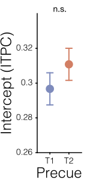
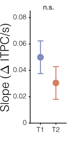
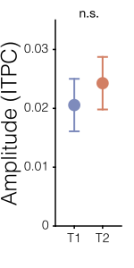
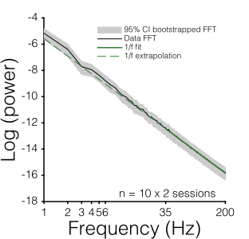
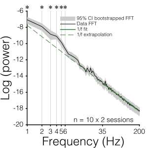

This repository contains the behavioral and MEG analyses associated with the paper: 

<strong>Anticipatory and evoked visual cortical dynamics of voluntary temporal attention</strong>  by Rachel Denison\*, Karen Tian\*, David Heeger, and Marisa Carrasco   <a href="https://www.biorxiv.org/content/10.1101/2022.11.18.517084v3" target="_blank">[<https://doi.org/10.1101/2022.11.18.517084>]</a> 

### Experiment code

-   <https://github.com/denisonlab/TANoise_MEG/tree/main/Experiment>

### Dependencies

-   [FieldTrip](https://www.fieldtriptoolbox.org/) Version FieldTrip-20220707
-   [Psychtoolbox](http://psychtoolbox.org/) Version 3.0.18
-   [vistadisp](https://github.com/vistalab/vistadisp)
-   [rd-utils](https://github.com/racheldenison/rd-utils)

### Figures

Figure 6  \| \|  \|  \|

Figure 5a and Supplementary Figure 3

|                                  Baseline period                                   |                              Anticipatory period                               |
|:----------------------------------:|:----------------------------------:|
|  |  |
